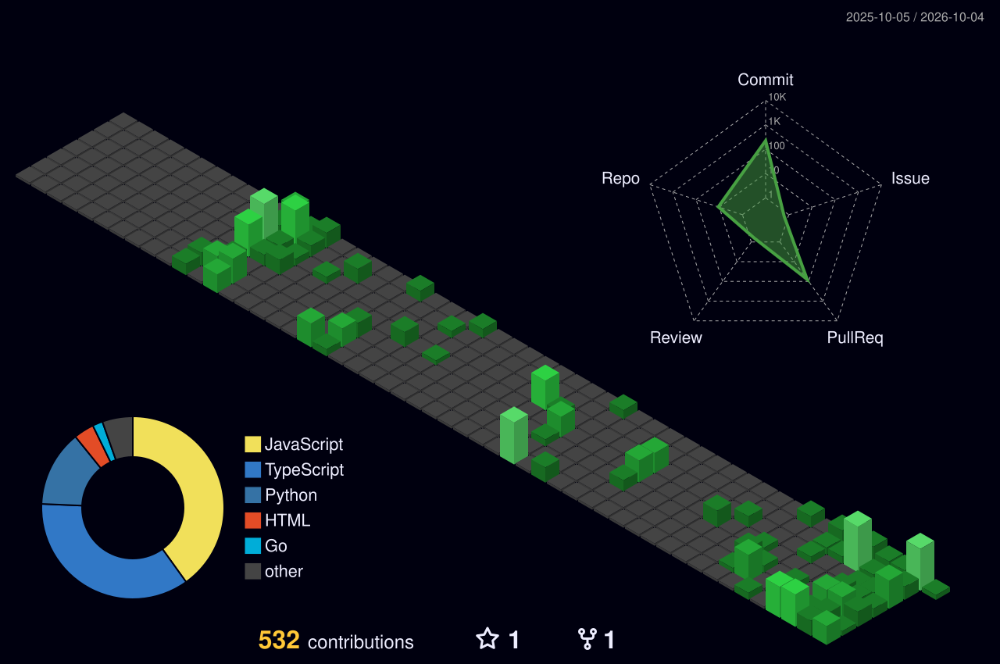

  

  <a href="#what-im-building">What I'm building</a> &nbsp; / &nbsp;
  <a href="#contributions-after-dark">Contributions</a> &nbsp; / &nbsp;
  <a href="#toolbox">Toolbox</a> &nbsp; / &nbsp;
  <a href="https://github.com/yukevindai?tab=repositories">All repositories ↗</a>

<h2>Hey, I'm Kevin 👋</h2>

I'm a **Chemical Engineering student at the University of Toronto**, building software where scientific research, machine learning, and practical problems meet.

I like tools that let researchers spend less time moving data around and more time figuring things out: tracing a result back to its source, checking what a model actually learned, and keeping the lessons from experiments that didn't work.

**Currently exploring:** AI for science · agent workflows · reproducible research.

## What I'm building

<table>
  <tr>
    <td width="50%" valign="top">
      <h3>01 / SciML Workbench</h3>
      
A workspace connecting scientific ML workflows and the tools behind them.

      
<code>Scientific ML</code> <code>Research workflows</code>

      <a href="https://github.com/yukevindai/sciml-workbench">Explore the workbench →</a>
    </td>
    <td width="50%" valign="top">
      <h3>02 / ChemData Auditor + SciSplit</h3>
      
Audit chemistry and materials datasets, then evaluate models with scientific holdouts.

      
<code>Data quality</code> <code>Generalization</code>

      <a href="https://github.com/yukevindai/chemdata-auditor">Look closer at the data →</a>
    </td>
  </tr>
  <tr>
    <td width="50%" valign="top">
      <h3>03 / Scientific Evidence Engine</h3>
      
Figure digitization with uncertainty, provenance, and verified exports.

      
<code>Evidence</code> <code>Provenance</code>

      <a href="https://github.com/yukevindai/scientific-evidence-engine">Trace the evidence →</a>
    </td>
    <td width="50%" valign="top">
      <h3>04 / Experiment Failure Memory</h3>
      
A private, self-hosted workspace for unsuccessful experiments and recovery attempts.

      
<code>Experiment history</code> <code>Research memory</code>

      <a href="https://github.com/yukevindai/experiment-failure-memory">Keep the lessons →</a>
    </td>
  </tr>
</table>

Also building [**ChemE ML Benchmarks**](https://github.com/yukevindai/cheme-ml-benchmarks) for reproducible model comparisons, and [**OpenChE**](https://github.com/yukevindai/OpenChE), an early chemical engineering discovery project.

## Contributions after dark

  

A year of building, one commit at a time. Generated daily with <a href="https://github.com/yoshi389111/github-profile-3d-contrib">github-profile-3d-contrib</a>.

## Toolbox

  
  
  
  
  
  

| Area | What I work with |
| :--- | :--- |
| Languages | Python · Java · JavaScript · TypeScript · Swift |
| Scientific computing & ML | PyTorch · scikit-learn · NumPy · pandas |
| Interfaces | React · Next.js · Tailwind CSS · HTML · CSS |
| Backend & data | FastAPI · Node.js · Express · PostgreSQL · Firebase |
| Development | Git · GitHub · Docker · Vercel |

<b>More things I've built</b>

| Project | The idea |
| :--- | :--- |
| [Gojee](https://github.com/yukevindai/Gojee) | An outing-planner web prototype; development has moved to a native app. |
| [DidItChangeYet](https://github.com/yukevindai/DidItChangeYet) | A Go tool that monitors URLs and sends change alerts. |
| [Expecta](https://github.com/yukevindai/Cursor-Hackathon-July-2026) | A hackathon prototype for barcode lookup and ingredient information. |
| [UofT ChemE MEng website](https://github.com/yukevindai/UofT-ChemE-MEng-Website-2026) | A static graduate-program website design/demo. |

---

<b>Always curious. Usually building something.</b> Explore the code, open an issue, or bring an interesting problem.

